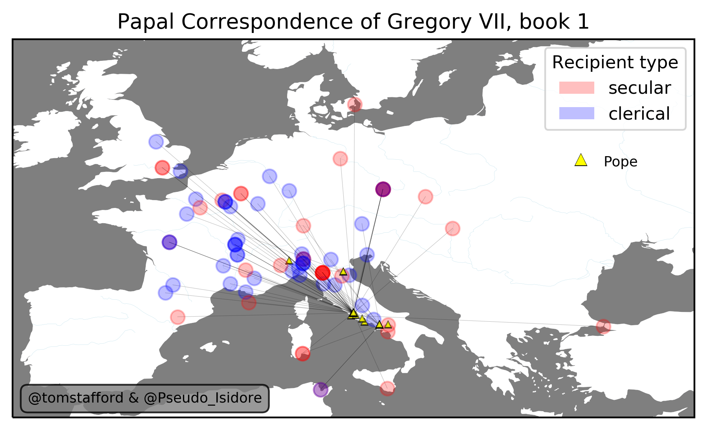
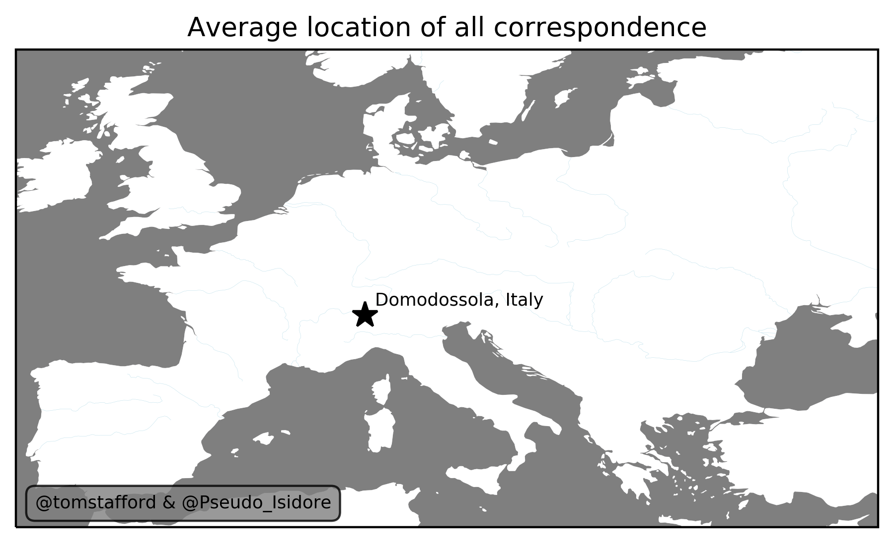

```{r setup, include=FALSE}

#This line sets defaults (mostly saying "show the code but not the errors and text outputs)
knitr::opts_chunk$set(echo = FALSE,fig.show="hold",warning=FALSE,results=FALSE,message=FALSE)

library(reticulate) #calling python from R/Rmarkdown. What a world
                      
```

```{python}

#Assumes python3
#You need to load the conda environment in the terminal,

#>conda env create --name mapping --file mapping.yml
#>conda activate mapping

import socket #to get host machine identity
import pandas as pd #dataframes
import os #file and folder functions
import numpy as np #number function
import datetime #date functions
import matplotlib.pyplot as plt #plotting function
import cartopy.crs as ccrs
import cartopy
import cartopy.feature as cfeature

```

# Aim

To take the Correspondance of Pope Gregory VII (1075-1085) and tabulate it (according to date, addressee etc), so as to allow visualisations --- particularly maps.

# Creating the data

The letters are recorded in 9 (?) published registers, available in PDF. The major work is to systemmatically record details of each letter in a spreadsheet, looking something like this:

```{python, results=TRUE}
df=pd.read_csv('data/gregory_vii_book1.csv') # this is the form we expect to get the data

df.head()

```

This tabulation creates a resource from which multiple possible analyses and visualisations can be built.

Consistent labelling is essential to create a coherant data set. It is worth thinking about what items we want to 'score' about each letter, before tabulating the data. 

* There are multiple letter 4s ("Version of the previous letter"). Do we want to explicitly code duplicates?
* Do we want to record recipient locations as in the letters, or in the modern names (e.g. Constantinople or Istanbul)?
* Only city names in the "place" column, no country

# Adding location information

Next we need to itentify each letter with a recipient location (in longitude and latitude)

Open questions
 
* Do we want the option to identify recipient locations as regions (e.g. "The Judges of Sardinia")?
* Who (and how) is going to check the geocoding?

These choices may not need to be made until after the letters have been tabulated. Tom may be able to perform some magic to pull longitude and latitude for most of the recipient locations off the internet (using some kind of wikidata query? Not sure yet).

Anyway, after tabulation and location coding, we have something like this (done by hand in this case):

```{python, results=TRUE}
#df_locs=get_location_info(df_locs) # need to do some geo magic to get location data from city names

df_places=pd.read_csv('data/places.csv')
df_locs=df.merge(df_places,how='left')

df_locs=df_locs.merge(df_places,how='left',left_on='Location of pope',right_on='place',suffixes=('','_pope'))
df_locs.drop(columns=['place_pope'],inplace=True)
df_locs.head()


```

# Creating A Map

We have tabulated and geocoded the information from the first book of letters (~80 letters, April 1073- to April 1074). Already this allows us to play around with some possible visualisations. First, a map

```{python}

#Cribbing from
#https://uoftcoders.github.io/studyGroup/lessons/python/cartography/lesson/
#and
#https://matthewkudija.com/blog/2018/04/21/travel-map-cartopy/

def new_base(df):
    #Long/Lat boundaries of Europe!
    top=60
    bottom=35
    left=-10
    right=35
    
    #Map projection
    ax = plt.axes(projection=ccrs.PlateCarree())
    
    # [lon_min, lon_max, lat_min, lat_max]
    ax.set_extent([left,right,bottom,top], crs=ccrs.PlateCarree())
    
    # add and color high-resolution land
    OCEAN_highres = cfeature.NaturalEarthFeature('physical', 'ocean', '50m',
                                                edgecolor='#B1B2B',
                                                facecolor='white',
                                                linewidth=.1
                                               )
    
    
    
    LAND_highres = cfeature.NaturalEarthFeature('physical', 'land', '50m',
                                                 facecolor='green',
                                                 linewidth=.1
                                             )    

    #This works, sort of, but doesn't add much at this scale
    RIVERS_highres = cfeature.NaturalEarthFeature('physical', 'rivers_lake_centerlines', '50m',
                                                  linewidth=0.1)
    

    ax.add_feature(OCEAN_highres, zorder=0, 
                   edgecolor='#B1B2B4', facecolor='#7f7f7f')
    

    ax.add_feature(LAND_highres,zorder=0,facecolor='white')
                       
    ax.add_feature(RIVERS_highres,facecolor='None',edgecolor='lightblue')
    


# -----------------> SET UP MAP

plt.clf()
new_base(df_locs)

# Location of Rome
rome_lati=41.9028
rome_long=12.4964

# Map parameters
marksize=16
popemarksize=3
popealpha=0.75

# -----------------> PUT ON LETTER DATA ON MAP

#Loop through dataset of letters
for index, row in df_locs.iterrows():
    colorcode='grey' #default
    if row['clerical/secular']=='s':
        colorcode='red'
    if row['clerical/secular']=='c':
        colorcode='blue'
        
    x=row['longitude'];y=row['latitude']
    pope_long=row['longitude_pope'];pope_lati=row['latitude_pope']
    plt.plot([pope_long,x],[pope_lati,y],lw=0.25,alpha=0.25,color='black')        
    plt.plot(x,y,'.',alpha=0.25,ms=marksize,color=colorcode)
    plt.plot(pope_long,pope_lati,'.',ms=popemarksize,alpha=popealpha,color='black',marker='^')        
    plt.plot(pope_long,pope_lati,'.',ms=popemarksize-1,alpha=popealpha,color='yellow',marker='^')        
        
    #plt.title(annotext)
    #plt.ylim([46,56])
    #plt.xlim([-4,2])
    


# -----------------> LEGEND AND ANNOTATIONS

plt.title('Papal Correspondence of Gregory VII, book 1')

from matplotlib.patches import Patch

legend_elements = [Patch(facecolor='red', alpha=0.25, label='secular'),
                   Patch(facecolor='blue', alpha=0.25, label='clerical')]

plt.legend(handles=legend_elements, title="Recipient type",loc='upper right')

#show the pope    
popemark_long=27.5;popemark_lat=52

plt.plot(popemark_long,popemark_lat,'.',alpha=1,ms=6,color='black',marker='^')        
plt.plot(popemark_long,popemark_lat,'.',alpha=1,ms=5,color='yellow',marker='^')        
plt.annotate('Pope',fontsize=8,xy=(popemark_long+1.5,popemark_lat-0.4))

plt.annotate('@tomstafford & @Pseudo_Isidore',fontsize=8,xy=(-9,36),bbox=dict(boxstyle='round,pad=0.5', fc='gray', alpha=0.8))

plt.savefig('map_book1.png',dpi=320,bbox_inches='tight')


```



$~$
$~$

# Other analyses

But now we have the data, additional analyses become possible. 

Like seeing the most frequent recepient types. Here is a list of all recipient types, along with the frequency they appear in book 1. For fun I am also showing the code which generates the list.

```{python, echo=TRUE, results=TRUE}
df_locs['recipient'].value_counts()
```

Note how "baron" and "barons" are counted as seperate entries. It is possible to catch these things after data tabulation, but it is easier if we anticipate and enter the original data in a way that means letters we think are the same are tabulated as such.

In this case, you could imagine having a single column "recipient type" and another "recipient number", so that "baron" and "barons" both got recorded as "baron" (under recipient type) and as "solo" and "multiple" (under recipient number, respectively).
$~$

Here are the top 15 most frequent receipient places:

```{python, echo=TRUE, results=TRUE}

df_locs['place'].value_counts().head(15)
```

$~$

Here is a map of numerical average of all the longtidude and latitudes of the receipients. Note it isn't clear what, if any, sense this makes, but it is suggestive of a kind of "center of gravity" of targets of papal correspondance. 

```{python}
plt.clf()
new_base(df_locs)

plt.title('Average location of all correspondence')
plt.annotate('@tomstafford & @Pseudo_Isidore',fontsize=8,xy=(-9,36),bbox=dict(boxstyle='round,pad=0.5', fc='gray', alpha=0.8))

center_lat=df_locs['latitude'].mean() #46.10233625
center_long=df_locs['longitude'].mean() #8.2351825

plt.plot(center_long,center_lat,ms=12,color='black',marker='*')
plt.annotate('Domodossola, Italy',fontsize=8,xy=(center_long+0.5,center_lat+0.5))

plt.savefig('map_book1_center.png',dpi=320,bbox_inches='tight')

#Other possible analyses

# repeat recipients
# distance each letter went (and divided by secular clerical)
# timing of letters across the year
```



$~$

Any suggestions for other possible analyses we can anticipate making?


$~$

## Colophon

This is an HTML page served by Github pages, generated from an RMarkdown document which uses the reticulate package to allow embedding of Python code. Files are all held in the github repositry: [github.com/tomstafford/PapalCorrespondence/](https://github.com/tomstafford/PapalCorrespondence/)
